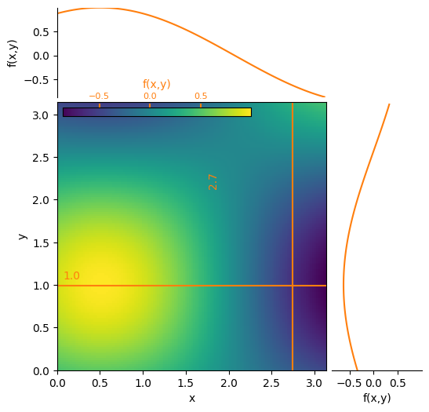

==========
sliceplots
==========

.. image:: https://img.shields.io/pypi/v/sliceplots.svg
        :target: https://pypi.python.org/pypi/sliceplots

.. image:: https://img.shields.io/travis/berceanu/sliceplots.svg
        :target: https://travis-ci.org/berceanu/sliceplots

.. image:: https://readthedocs.org/projects/sliceplots/badge/?version=latest
        :target: https://sliceplots.readthedocs.io/en/latest/?badge=latest
        :alt: Documentation Status

.. image:: https://pyup.io/repos/github/berceanu/sliceplots/shield.svg
     :target: https://pyup.io/repos/github/berceanu/sliceplots/
     :alt: Updates

``sliceplots`` is a thin wrapper on top of ``matplotlib``'s ``.imshow()`` for 2D plotting, with attached slice plots

* Free software: BSD license
* Documentation: https://sliceplots.readthedocs.io.

Features
--------

* uses the pure OO (look Ma, no ``pyplot``!) interface of ``matplotlib``

Quick start
-----------

Install the package via:

.. code-block:: console

        $ pip install sliceplots

Generate a quick slice plot:

.. code-block:: python

        import numpy as np
        import sliceplots.two_dimensional as two_d

        axis_data = np.linspace(0, np.pi, 128)
        data_2d = np.cos(axis_data - 0.5) * np.cos(axis_data.reshape(-1, 1) - 1.0)

        p2d = two_d.Plot2D(data_2d,
                           axis_data,
                           axis_data,
                           xlabel='x',
                           ylabel='y',
                           zlabel='f(x,y)',
                           hslice_val=1.0,
                           vslice_val=2.75,
                           figsize=(6.0, 6.0))
        p2d.fig.savefig("imshow_slices.png", bbox_inches='tight')

Credits
-------

Big thanks to `@afvincent`_ for `this gist`_.

.. _`@afvincent`: https://github.com/afvincent
.. _`this gist`: https://gist.github.com/afvincent/0e6b743e32a3fa62b580657693163b7e
