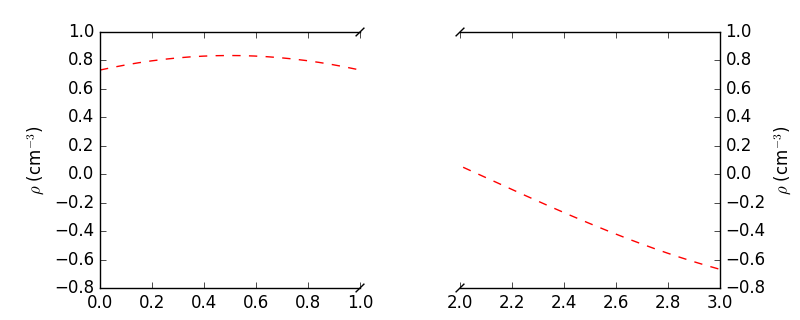
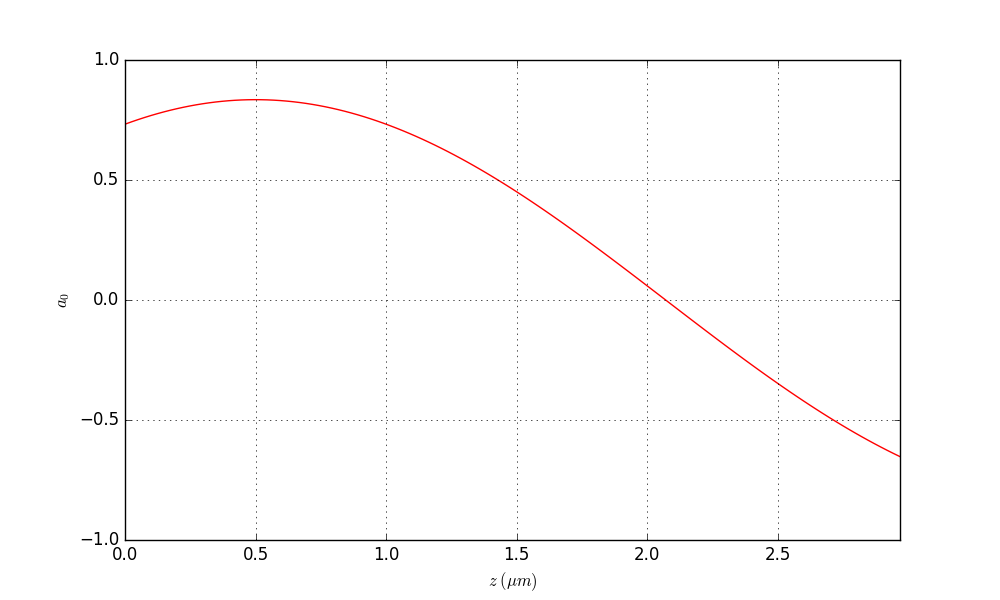
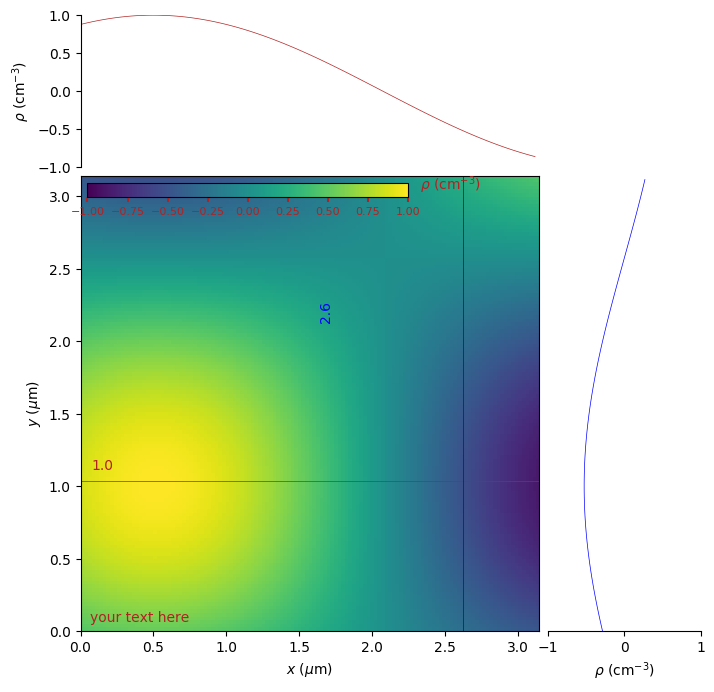

=====
Usage
=====

To use ``sliceplots`` in a project, we first import it and generate some data:

.. jupyer-execute::

    import numpy as np
    from matplotlib import pyplot
    %matplotlib inline

    x = np.linspace(0, 2 * np.pi)

    pyplot.plot(x, np.sin(x) / x)
    pyplot.plot(x, np.cos(x))
    pyplot.grid()

.. jupyer-execute::

    import sliceplots.one_dimensional as one_d

    # data for plotting
    uu = np.linspace(0, np.pi, 128)
    data = np.cos(uu - 0.5) * np.cos(uu.reshape(-1, 1) - 1.0)

here is an example of a "broken-axis" plot:

.. jupyter-execute::

    fig, ax = pyplot.subplots(figsize=(8, 3.2))
    one_d.plot1d_break_x(fig, uu, data[data.shape[0] // 2, :],
                            {'xlim_left': (0, 1),
                            'xlim_right': (2, 3),
                            'xlabel': r'$x$ ($\mu$m)',
                            'ylabel': r'$\rho$ (cm$^{-3}$)'},
                            {'ls': '--', 'color': 'red'})
    fig.savefig("plot1d_break_x.png", bbox_inches='tight')

The :py:class:`sliceplots.one_dimensional.Plot1D` class is a very thin wrapper \
around :py:meth:`matplotlib.axes.Axes.plot`:

.. jupyter-execute::

    p1d = one_d.Plot1D(uu,
                    data[data.shape[0] // 2, :],
                    xlabel=r'$%s \;(\mu m)$' % 'z',
                    ylabel=r'$%s$' % 'a_0',
                    xlim=[0, 3],
                    ylim=[-1, 1],
                    figsize=(10, 6),
                    color='red')
    p1d.fig.savefig('plot1d.png', bbox_inches='tight')

While :py:class:`sliceplots.two_dimensional.Plot2D` wraps :py:meth:`matplotlib.axes.Axes.imshow`:

.. jupyter-execute::

    import sliceplots.two_dimensional as two_d

    p2d = two_d.Plot2D(data,
                       uu,
                       uu,
                       xlabel=r'$x$ ($\mu$m)',
                       ylabel=r'$y$ ($\mu$m)',
                       zlabel=r'$\rho$ (cm$^{-3}$)',
                       hslice_val=0.75,
                       vslice_val=2.75,
                       hslice_opts={'color': '#1f77b4', 'lw': 0.5, 'ls': '-'},
                       vslice_opts={'color': '#d62728', 'ls': '-'},
                       figsize=(8, 8),
                       cmap='viridis',
                       cbar=True,
                       extent=(0, np.pi, 0, np.pi),
                       vmin=-1.0,
                       vmax=1.0,
                       text='your text here')
    p2d.fig.savefig("plot2d.png", bbox_inches='tight')

Different data normalization functions from :py:mod:`matplotlib.colors` can be \
used, by passing :code:`norm=colors.LogNorm()` or \
:code:`norm=colors.SymLogNorm(linthresh=1e-4)`.

